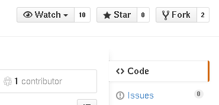
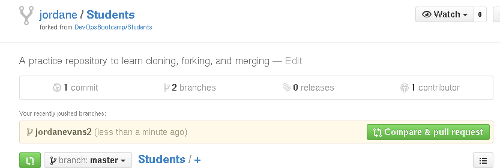

Jordan Evans
============


Hi! I'm Jordan Evans. I am a full-time Systems Administrator at the Open Source Lab.

This is an old picture of me:


Making your own file
====================

First, click on the `fork` button near the upper-right corner to fork the repository into your own github account. Here is a picture of the button:



After that: clone the repository:

```bash
$ git clone git@github.com:devopsbootcamp/students
```

This will make a directory in the present working directory called `students`. Inside
the git repository is another directory called `students`. Change into the second students directory

```bash
$ cd students
$ ls
README.md students
$ cd students
$ ls
_static jordanevans.md
```

_Before_ making your own file, you should first make a branch in git:

```bash
$ git checkout -b <branch name>
```

`checkout -b` will both create and check out the branch for you. You can confirm
which branch you are by running:

```bash
$ git branch
* jordanevans
  master
```

The `*` means I am currently on the branch `jordanevans`.

Make your own file in this same directory. If you want to include a picture
you can place it in the `_static` directory, and then add:

```

```

into your file.

Make sure your file ends in `.md`!

Once you are finished with your file, add it (`git add <filename>`) and
make a commit (`git commit`). Push your branch:

```bash
$ git push origin <branchname>
```

Now go to your fork in your browser: `https://github.com/<username>/students`.

You should see a green `Compare & pull request` button. Click it!



You will be taken to a new page.


Make sure of the following:

  * You have a meaningful title
  * You have a meaningful comment (this can be very short)
  * You are opening the pull request `DevOpsBootcamp:master ... <your username>:<your branch>`. The right side
    is the branch you are merging, and the left the one you want to merge into.
  * The right side should say 'Able to merge' in green.

Then click `'Create pull request'` and get our attention -- we will review and comment or merge it in!